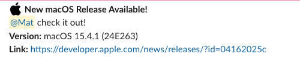

# macOS Update Notifier

This GitHub Actions workflow checks the official [Apple Developer News RSS feed](https://developer.apple.com/news/releases/rss/releases.rss) daily for new **stable macOS releases**, and sends a Slack message when one is detected.

## 🚀 What It Does

- Runs daily at 2:00 AM UTC
- Filters out **beta** and **release candidate (RC)** macOS updates
- Tracks the **last notified version** in `last_macos_version.txt`
- Sends a Slack message to a channel and tags a user when a new version is released

## 🔧 Setup Instructions

### 1. Fork or Clone This Repo

Clone the repo to your machine:
git clone https://github.com/yourusername/macos-update-notifier.git
cd macos-update-notifier

### 2. Add Your Slack Webhook

Create an [Incoming Webhook](https://api.slack.com/messaging/webhooks) in your Slack workspace and copy the URL.

Then, add it as a **GitHub repository secret**:

- Go to **Settings > Secrets and variables > Actions**
- Click **"New repository secret"**
- Name it: `SLACK_WEBHOOK_URL`
- Paste your Slack webhook URL

### 3. Workflow Details

The GitHub Actions workflow is defined in:
.github/workflows/macos_update_check.yml

It performs the following steps:

- Checks out the repository
- Installs required tools (`xmlstarlet` and `jq`)
- Runs the update check script
- Saves the last seen version
- Sends a Slack message if the version changed
- Commits the updated version file back to the repo

### 4. Manual Test

To test it manually:

- Go to the **Actions** tab in your GitHub repo
- Select **"Check macOS Updates"**
- Click **"Run workflow"**

## 5. Example Slack Notification

Here's how the alert looks in Slack with option using of using a slack ID to @ a user.
The script is set to @here so anyone added to the channel is notified.

---

## 📄 Key Files

- `get_latest_macOS_sofa.sh` – Main script that checks for updates and sends Slack messages
- `last_macos_version.txt` – Tracks the last notified version
- `.github/workflows/macos_update_check.yml` – GitHub Actions workflow file

---

## 🛡 License

MIT — free to use and modify.
